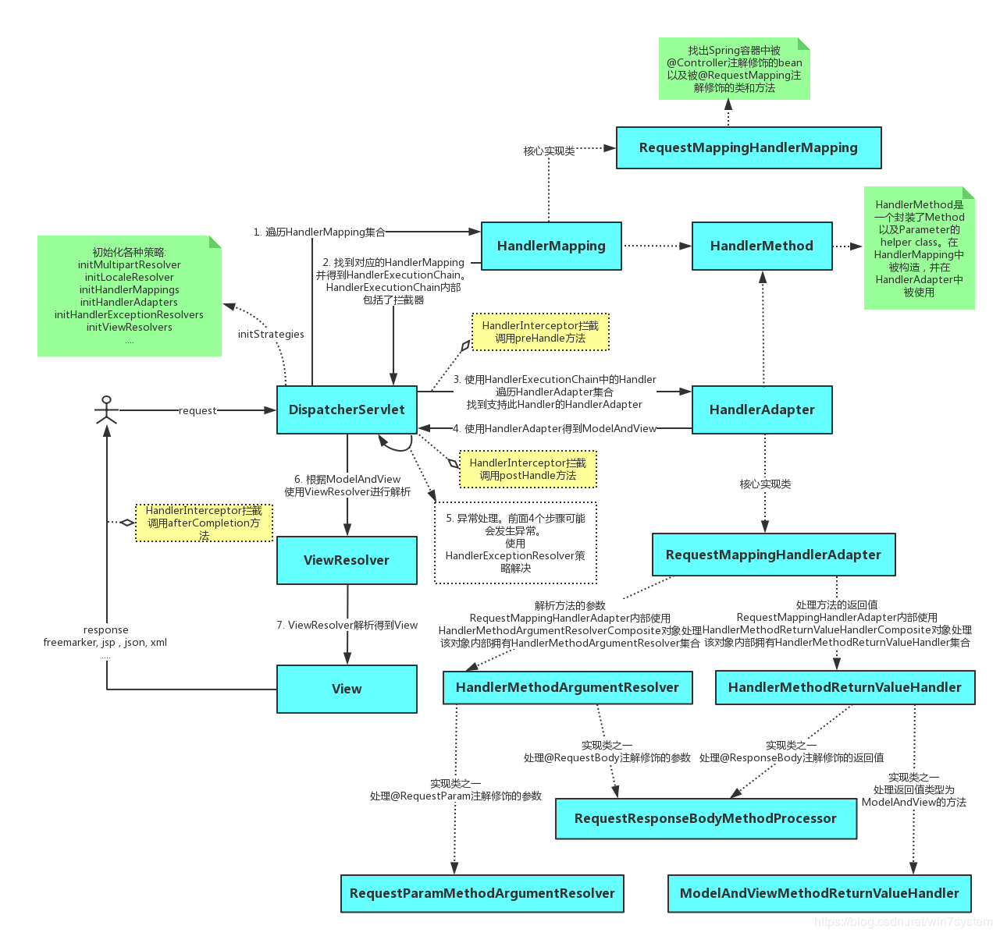

##### 流程说明：

（1）客户端（浏览器）发送请求，直接请求到DispatcherServlet。

（2）DispatcherServlet根据请求信息调用HandlerMapping，解析请求对应的Handler。

（3）解析到对应的Handler后，开始由HandlerAdapter适配器处理。

（4）HandlerAdapter会根据Handler来调用真正的处理器开处理请求，并处理相应的业务逻辑。

（5）处理器处理完业务后，会返回一个ModelAndView对象，Model是返回的数据对象，View是个逻辑上的View。

（6）ViewResolver会根据逻辑View查找实际的View。

（7）DispaterServlet把返回的Model传给View。

（8）通过View返回给请求者（浏览器）


**DispatcherServlet是整个Spring MVC的核心。它负责接收HTTP请求组织协调Spring MVC的各个组成部分。其主要工作有以下三项：**

1. 1. 截获符合特定格式的URL请求。
   2. 初始化DispatcherServlet上下文对应的WebApplicationContext，并将其与业务层、持久化层的WebApplicationContext建立关联。
   3. 初始化Spring MVC的各个组成组件，并装配到DispatcherServlet中。


##### DispatcherServlet类中的属性beans：

HandlerMapping：用于handlers映射请求和一系列的对于拦截器的前处理和后处理，大部分用@Controller注解。

HandlerAdapter：帮助DispatcherServlet处理映射请求处理程序的适配器，而不用考虑实际调用的是 哪个处理程序。

HandlerExceptionResolver：处理映射异常。

ViewResolver：根据实际配置解析实际的View类型。

LocaleResolver：解决客户正在使用的区域设置以及可能的时区，以便能够提供国际化视野。

ThemeResolver：解决Web应用程序可以使用的主题，例如提供个性化布局。

MultipartResolver：解析多部分请求，以支持从HTML表单上传文件。

FlashMapManager：存储并检索可用于将一个请求属性传递到另一个请求的input和output的FlashMap，通常用于重定向。

在Web MVC框架中，每个DispatcherServlet都拥自己的WebApplicationContext，它继承了ApplicationContext。WebApplicationContext包含了其上下文和Servlet实例之间共享的所有的基础框架beans。


## WebMvcConfigurer的常用接口

```java
 /* 拦截器配置 */
void addInterceptors(InterceptorRegistry var1);
/* 视图跳转控制器 */
void addViewControllers(ViewControllerRegistry registry);
/**
     *静态资源处理
**/
void addResourceHandlers(ResourceHandlerRegistry registry);
/* 默认静态资源处理器 */
void configureDefaultServletHandling(DefaultServletHandlerConfigurer configurer);
/**
     * 这里配置视图解析器
 **/
void configureViewResolvers(ViewResolverRegistry registry);
/* 配置内容裁决的一些选项*/
void configureContentNegotiation(ContentNegotiationConfigurer configurer);
/** 解决跨域问题 **/
public void addCorsMappings(CorsRegistry registry) ;
```

###  addInterceptors：拦截器

- addInterceptor：需要一个实现HandlerInterceptor接口的拦截器实例

- addPathPatterns：用于设置拦截器的过滤路径规则；`addPathPatterns("/**")`对所有请求都拦截

- excludePathPatterns：用于设置不需要拦截的过滤规则

- 拦截器主要用途：进行用户登录状态的拦截，日志的拦截等。

### addResourceHandlers：静态资源

比如，我们想自定义静态资源映射目录的话，只需重写addResourceHandlers方法即可。

注：如果继承WebMvcConfigurationSupport类实现配置时必须要重写该方法

### addCorsMappings：跨域

```java
@Override
public void addCorsMappings(CorsRegistry registry) {
    super.addCorsMappings(registry);
    registry.addMapping("/cors/**")
            .allowedHeaders("*")
            .allowedMethods("POST","GET")
            .allowedOrigins("*");
}
```


```java
 /**
     * addPathPatterns("/**")对所有请求都拦截，但是排除了/toLogin和/login请求的拦截。
     * 当spring boot版本升级为2.x时，访问静态资源就会被HandlerInterceptor拦截,网上有很多处理办法都是如下写法
     * .excludePathPatterns("/index.html","/","/user/login","/static/**");
     * @param registry
     */
    @Override
    public void addInterceptors(InterceptorRegistry registry) {
        registry.addInterceptor(new MyInterceptor()).addPathPatterns("/**").excludePathPatterns("/index.html","/","/user/login","/static/**");
    }

    /**
     * 以前要访问一个页面需要先创建个Controller控制类，再写方法跳转到页面
     * 在这里配置后就不需要那么麻烦了，直接访问http://localhost:8080/toLogin就跳转到login.jsp页面了
     * @param registry
     */
    @Override
    public void addViewControllers(ViewControllerRegistry registry) {
        registry.addViewController("/toLogin").setViewName("login");

    }
	
    @Override
    public void addResourceHandlers(ResourceHandlerRegistry registry) {
        registry.addResourceHandler("/page/**").addResourceLocations("classpath:/page/");
    }

    @Override
    public void configureMessageConverters(List<HttpMessageConverter<?>> converters) {

    }

    @Override
    public void configureDefaultServletHandling(DefaultServletHandlerConfigurer configurer) {
        configurer.enable();
        configurer.enable("defaultServletName");
    }

    @Override
    public void configureContentNegotiation(ContentNegotiationConfigurer configurer) {

    }

```


#### springmvc常见面试题

1、什么是Spring MVC ？简单介绍下你对springMVC的理解?

Spring MVC是一个基于Java的实现了MVC设计模式的请求驱动类型的轻量级Web框架，通过把Model，View，Controller分离，将web层进行职责解耦，把复杂的web应用分成逻辑清晰的几部分，简化开发，减少出错，方便组内开发人员之间的配合。

2、SpringMVC的流程？

（1）用户发送请求至前端控制器DispatcherServlet；
（2） DispatcherServlet收到请求后，调用HandlerMapping处理器映射器，请求获取Handle；
（3）处理器映射器根据请求url找到具体的处理器，生成处理器对象及处理器拦截器(如果有则生成)一并返回给DispatcherServlet；
（4）DispatcherServlet 调用 HandlerAdapter处理器适配器；
（5）HandlerAdapter 经过适配调用 具体处理器(Handler，也叫后端控制器)；
（6）Handler执行完成返回ModelAndView；
（7）HandlerAdapter将Handler执行结果ModelAndView返回给DispatcherServlet；
（8）DispatcherServlet将ModelAndView传给ViewResolver视图解析器进行解析；
（9）ViewResolver解析后返回具体View；
（10）DispatcherServlet对View进行渲染视图（即将模型数据填充至视图中）
（11）DispatcherServlet响应用户。

3、Springmvc的优点:

（1）可以支持各种视图技术,而不仅仅局限于JSP；

（2）与Spring框架集成（如IoC容器、AOP等）；

（3）清晰的角色分配：前端控制器(dispatcherServlet) , 请求到处理器映射（handlerMapping), 处理器适配器（HandlerAdapter), 视图解析器（ViewResolver）。

（4） 支持各种请求资源的映射策略。

4、Spring MVC的主要组件？

（1）前端控制器 DispatcherServlet（不需要程序员开发）

作用：接收请求、响应结果，相当于转发器，有了DispatcherServlet 就减少了其它组件之间的耦合度。

（2）处理器映射器HandlerMapping（不需要程序员开发）

作用：根据请求的URL来查找Handler

（3）处理器适配器HandlerAdapter

注意：在编写Handler的时候要按照HandlerAdapter要求的规则去编写，这样适配器HandlerAdapter才可以正确的去执行Handler。

（4）处理器Handler（需要程序员开发）

（5）视图解析器 ViewResolver（不需要程序员开发）

作用：进行视图的解析，根据视图逻辑名解析成真正的视图（view）

（6）视图View（需要程序员开发jsp）

View是一个接口， 它的实现类支持不同的视图类型（jsp，freemarker，pdf等等）


SpringMvc怎么和AJAX相互调用的？

通过Jackson框架就可以把Java里面的对象直接转化成Js可以识别的Json对象。具体步骤如下 ：

（1）加入Jackson.jar

（2）在配置文件中配置json的映射

（3）在接受Ajax方法里面可以直接返回Object,List等,但方法前面要加上@ResponseBody注解。

**如何解决POST请求中文乱码问题，GET的又如何处理呢？**

（1）解决post请求乱码问题：

在web.xml中配置一个CharacterEncodingFilter过滤器，设置成utf-8；


9、Spring MVC的异常处理 ？

答：可以将异常抛给Spring框架，由Spring框架来处理；我们只需要配置简单的异常处理器，在异常处理器中添视图页面即可。

10、SpringMvc的控制器是不是单例模式,如果是,有什么问题,怎么解决？

答：是单例模式,所以在多线程访问的时候有线程安全问题,不要用同步,会影响性能的,解决方案是在控制器里面不能写字段。

11、 SpringMVC常用的注解有哪些？

@RequestMapping：用于处理请求 url 映射的注解，可用于类或方法上。用于类上，则表示类中的所有响应请求的方法都是以该地址作为父路径。

@RequestBody：注解实现接收http请求的json数据，将json转换为java对象。

@ResponseBody：注解实现将conreoller方法返回对象转化为json对象响应给客户。

12、SpingMvc中的控制器的注解一般用那个,有没有别的注解可以替代？

答：一般用@Controller注解,也可以使用@RestController,@RestController注解相当于@ResponseBody ＋ @Controller,表示是表现层,除此之外，一般不用别的注解代替。

13、如果在拦截请求中，我想拦截get方式提交的方法,怎么配置？

答：可以在@RequestMapping注解里面加上method=RequestMethod.GET。

14、怎样在方法里面得到Request,或者Session？

答：直接在方法的形参中声明request,SpringMvc就自动把request对象传入。

15、如果想在拦截的方法里面得到从前台传入的参数,怎么得到？

答：直接在形参里面声明这个参数就可以,但必须名字和传过来的参数一样。

16、如果前台有很多个参数传入,并且这些参数都是一个对象的,那么怎么样快速得到这个对象？

答：直接在方法中声明这个对象,SpringMvc就自动会把属性赋值到这个对象里面。

17、SpringMvc中函数的返回值是什么？

答：返回值可以有很多类型,有String, ModelAndView。ModelAndView类把视图和数据都合并的一起的，但一般用String比较好。

18、SpringMvc用什么对象从后台向前台传递数据的？

答：通过ModelMap对象,可以在这个对象里面调用put方法,把对象加到里面,前台就可以通过el表达式拿到。

19、怎么样把ModelMap里面的数据放入Session里面？

答：可以在类上面加上@SessionAttributes注解,里面包含的字符串就是要放入session里面的key。


21、注解原理：

注解本质是一个继承了Annotation的特殊接口，其具体实现类是Java运行时生成的动态代理类。我们通过反射获取注解时，返回的是Java运行时生成的动态代理对象。通过代理对象调用自定义注解的方法，会最终调用AnnotationInvocationHandler的invoke方法。该方法会从memberValues这个Map中索引出对应的值。而memberValues的来源是Java常量池


